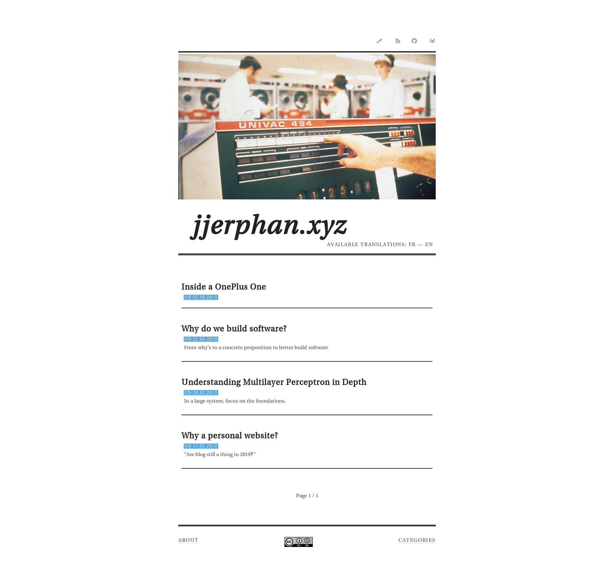

# feather : A light pelican theme 🍃

This is a port of a port of the Martin theme by Allison House to work with the
[Pelican static site generator](http://blog.getpelican.com/)

## Theme overview
Check out the [live demo](http://jjerphan.xyz/).



## Plugin support
It supports the the following plugins or variables
- [Neighbor Article Plugin](https://github.com/getpelican/pelican-plugins/tree/master/neighbors)
- [font awesome](http://fortawesome.github.io/Font-Awesome/) for social and
share links specified by global variables and the name of the font awesome icon
after "fa-".

e.g.:
```python
# Social widget
SOCIAL = (('github', 'http://github.com/username),
          ('twitter', 'http://twitter.com/username),
          ('gitlab', 'http://gitlab.com/username))

SHARE = (('twitter', 'http://twitter.com/share', '?text=', '&amp;url='))
```

- [Disqus](http://www.disqus.com) integration setting the variable
```python
DISQUS_SITENAME = "your_site_name"
```

## License

This work is licensed under a [Creative Commons Attribution-ShareAlike 3.0
Unported License](http://creativecommons.org/licenses/by-sa/3.0/).

This is a port of a port of the Martin theme by Allison House to work with the Pelican static site generator
